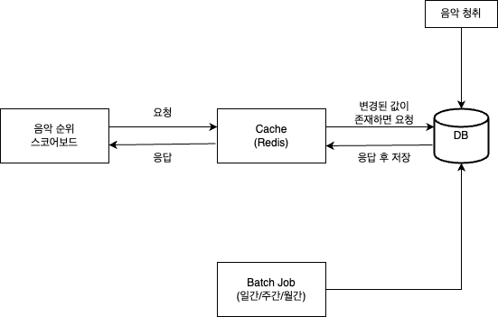
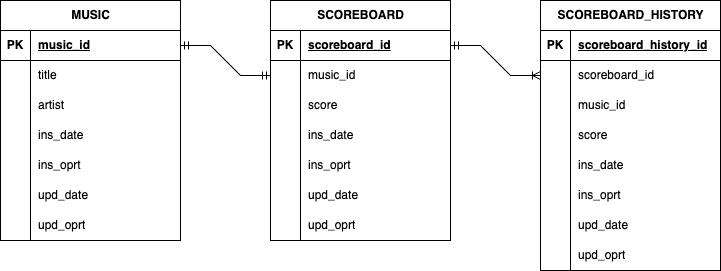

# study-ranking-system-greatfarmer

### 목표
- 뮤직플레이어의 음악 순위 시스템을 구현

### 기능적 요구사항
- 사용자는 매일 TOP100의 음악 순위를 볼 수 있습니다.
- 사용자는 특정 음악의 순위와 점수를 볼 수 있습니다.
- 사용자는 특정 음악의 과거 순위와 점수를 볼 수 있습니다.
- (선택) 사용자는 푸시 알림을 통해 특정 음악의 순위 변동을 알 수 있습니다.

### 비기능적 요구사항
- 모든 쿼리는 3초 이내에 실행되어야 합니다.
- 음악 순위 스코어보드를 캐싱처리 합니다.

### 아키텍처


### 테이블 설계


### DDL
```sql
CREATE TABLE MUSIC (
    music_id INT UNSIGNED PRIMARY KEY AUTO_INCREMENT,
    title VARCHAR(255) NOT NULL,
    artist VARCHAR(255) NOT NULL,
    ins_date DATETIME DEFAULT CURRENT_TIMESTAMP,
    ins_oprt VARCHAR(50) DEFAULT "anonymous" NOT NULL,
    upd_date DATETIME DEFAULT CURRENT_TIMESTAMP ON UPDATE CURRENT_TIMESTAMP,
    upd_oprt VARCHAR(50) DEFAULT "anonymous" NOT NULL
) ENGINE=InnoDB DEFAULT CHARSET=utf8mb4 COLLATE=utf8mb4_general_ci;

CREATE TABLE SCOREBOARD (
    scoreboard_id INT UNSIGNED PRIMARY KEY AUTO_INCREMENT,
    music_id INT UNSIGNED,
    score INT UNSIGNED,
    ins_date DATETIME DEFAULT CURRENT_TIMESTAMP,
    ins_oprt VARCHAR(50) DEFAULT "anonymous" NOT NULL,
    upd_date DATETIME DEFAULT CURRENT_TIMESTAMP ON UPDATE CURRENT_TIMESTAMP,
    upd_oprt VARCHAR(50) DEFAULT "anonymous" NOT NULL
) ENGINE=InnoDB DEFAULT CHARSET=utf8mb4 COLLATE=utf8mb4_general_ci;

-- A trigger is executed when an INSERT, UPDATE occurs on the SCOREBOARD table.
CREATE TABLE SCOREBOARD_HISTORY (
    scoreboard_history_id INT UNSIGNED PRIMARY KEY AUTO_INCREMENT,
    scoreboard_id INT UNSIGNED,
    music_id INT UNSIGNED,
    score INT UNSIGNED,
    ins_date DATETIME DEFAULT CURRENT_TIMESTAMP,
    ins_oprt VARCHAR(50) DEFAULT "anonymous" NOT NULL,
    upd_date DATETIME DEFAULT CURRENT_TIMESTAMP ON UPDATE CURRENT_TIMESTAMP,
    upd_oprt VARCHAR(50) DEFAULT "anonymous" NOT NULL
) ENGINE=InnoDB DEFAULT CHARSET=utf8mb4 COLLATE=utf8mb4_general_ci;
```

### API
- GET /v1/music/id/{id}
    - Response
        ```json
            {
                "id": 1,
                "title": "24K Magic",
                "artist": "Bruno Mars",
                "score": 143,
                "rank": 1
            }
        ```
- GET /v1/music/title/{title}
    - Response
        ```json
            {
                "id": 1,
                "title": "24K Magic",
                "artist": "Bruno Mars",
                "score": 143,
                "rank": 1
            }
        ```
- GET /v1/music/artist/{artist}
    - Response
        ```json
            {
                "id": 1,
                "title": "24K Magic",
                "artist": "Bruno Mars",
                "score": 143
            }
        ```
- GET /v1/music/scoreboard/daily/top/{count}
    - Response
        ```json
            [
                {
                    "id": 1,
                    "title": "24K Magic",
                    "artist": "Bruno Mars",
                    "score": 143
                },
                {
                    "id": 2,
                    "title": "Shake It Off",
                    "artist": "Taylor Swift",
                    "score": 98
                }
            ]
        ```
- POST /v1/music/id/{id}/increase/{score}
    - Response
        ```json
            {
                "id": 1,
                "title": "24K Magic",
                "artist": "Bruno Mars",
                "score": 144
            },
        ```

### 디렉토리 구조
```
kr.co.music
├── MusicAppApplication.kt
│
├── config/             → 설정 (Web, Security, Swagger 등)
│
├── controller/         → API 요청/응답 처리
│   └── MusicController.kt
│
├── service/            → 비즈니스 로직 처리
│   └── MusicService.kt
│
├── repository/         → DB 접근 (JPA, MyBatis 등)
│   └── MusicRepository.kt
│
├── domain/             → Entity 클래스
│   └── MusicEntity.kt
│
├── dto/                → 요청/응답 DTO
│   ├── MusicRequestDto.kt
│   └── MusicResponseDto.kt
│
├── exception/          → 공통 예외 처리
│   ├── GlobalExceptionHandler.kt
│   └── CustomException.kt
│
└── util/               → 공통 유틸, Mapper 등
```

### 기술스택
- Kotlin (Java 17)
- Spring Boot 3.3.X
- H2 DB
- Flyway 10.10.X
- Swagger (SpringDoc OpenAPI Starter WebMVC UI)

### 참고
- System Design
  - [Leaderboard System Design](https://systemdesign.one/leaderboard-system-design/)
- Flyway
  - https://github.com/callicoder/spring-boot-flyway-example
- Redis
  - [Redis와 클라이언트 캐시 간 데이터 동기화 기술 - Redis Client Caching 살펴보기](https://devocean.sk.com/blog/techBoardDetail.do?ID=167301&boardType=techBlog)
  - [Redis를 사용하여 랭킹 시스템을 구현하면 정말 빠를까?](https://velog.io/@koomin1227/Redis%EB%A5%BC-%EC%82%AC%EC%9A%A9%ED%95%98%EC%97%AC-%EB%9E%AD%ED%82%B9-%EC%8B%9C%EC%8A%A4%ED%85%9C%EC%9D%84-%EA%B5%AC%ED%98%84%ED%95%98%EB%A9%B4-%EC%A0%95%EB%A7%90-%EB%B9%A0%EB%A5%BC%EA%B9%8C)
  - 개발자를 위한 레디스 튜토리얼 [01](https://medium.com/garimoo/%EA%B0%9C%EB%B0%9C%EC%9E%90%EB%A5%BC-%EC%9C%84%ED%95%9C-%EB%A0%88%EB%94%94%EC%8A%A4-%ED%8A%9C%ED%86%A0%EB%A6%AC%EC%96%BC-01-92aaa24ca8cc), [02](https://medium.com/garimoo/%EA%B0%9C%EB%B0%9C%EC%9E%90%EB%A5%BC-%EC%9C%84%ED%95%9C-%EB%A0%88%EB%94%94%EC%8A%A4-%ED%8A%9C%ED%86%A0%EB%A6%AC%EC%96%BC-02-f1029893e263), [03](https://medium.com/garimoo/%EA%B0%9C%EB%B0%9C%EC%9E%90%EB%A5%BC-%EC%9C%84%ED%95%9C-%EB%A0%88%EB%94%94%EC%8A%A4-%ED%8A%9C%ED%86%A0%EB%A6%AC%EC%96%BC-03-1d5fa7ca9682), [04](https://medium.com/garimoo/%EA%B0%9C%EB%B0%9C%EC%9E%90%EB%A5%BC-%EC%9C%84%ED%95%9C-%EB%A0%88%EB%94%94%EC%8A%A4-%ED%8A%9C%ED%86%A0%EB%A6%AC%EC%96%BC-04-17256c55493d)
  - [Spring Boot Cache with Redis](https://www.baeldung.com/spring-boot-redis-cache)